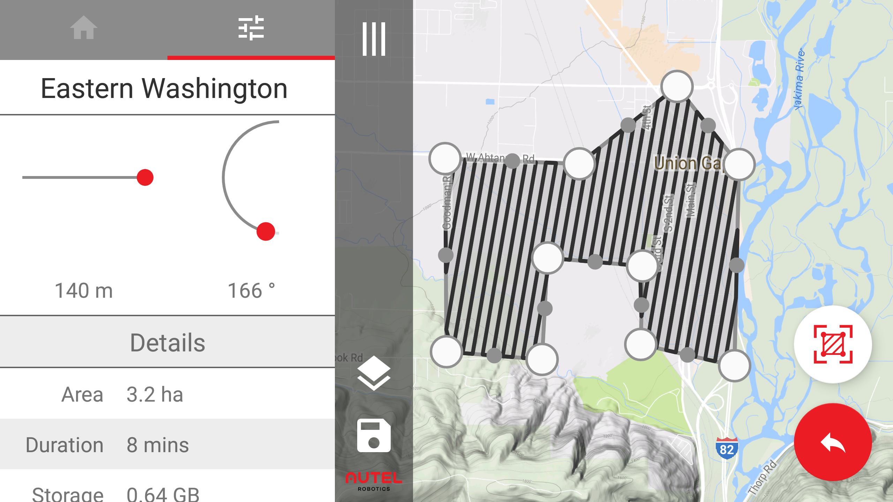
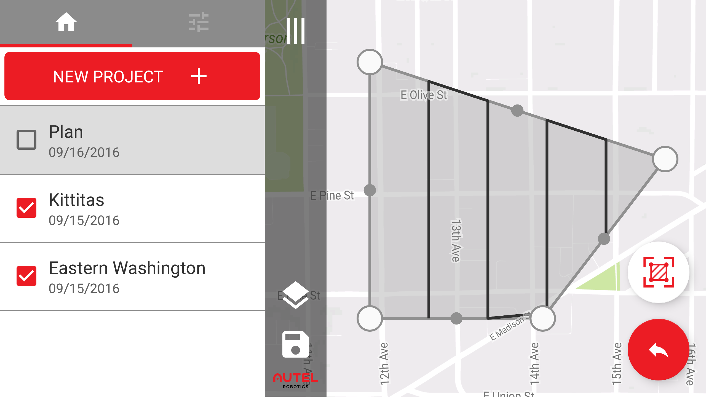

# Hector

## Screenshots

## Summary

Hector is designed to simplify agricultural surveying using drones produced by Autel Robotics.  Given a polygon drawn by the user, the application will produce and store a survey route that will cover the entire selected area.  With the click of a button, Hector will convert this route into coordinates, transmit them to an active drone, and carry out the flight plan.

The screenshots above show three different scenarios within the application.
 - The first is the main view of the application with the control drawer closed. This gives the user the largest possible amount of screen space to alter their flight plan.
 - The second is the main view with the drawer open to the flight configuration tab. From the flight configuration tab, users can adjust altitude and angle of flight to optimize their flight plan.
 - The third shows the main view with the drawer open to the projects view. This allows users to edit, create and delete projects and easily switch between them.

## Contributors

Matthew Duffin - Android Developer

Severin Rudie - Android Developer

Michael M Kang - Android Developer
